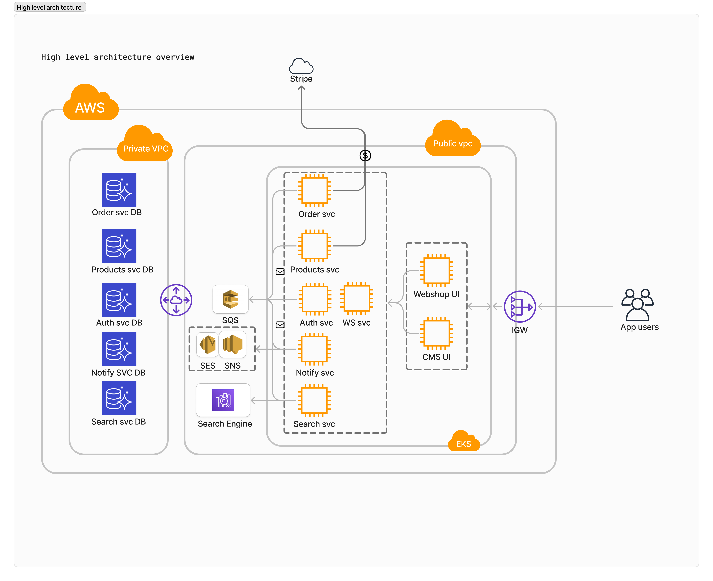
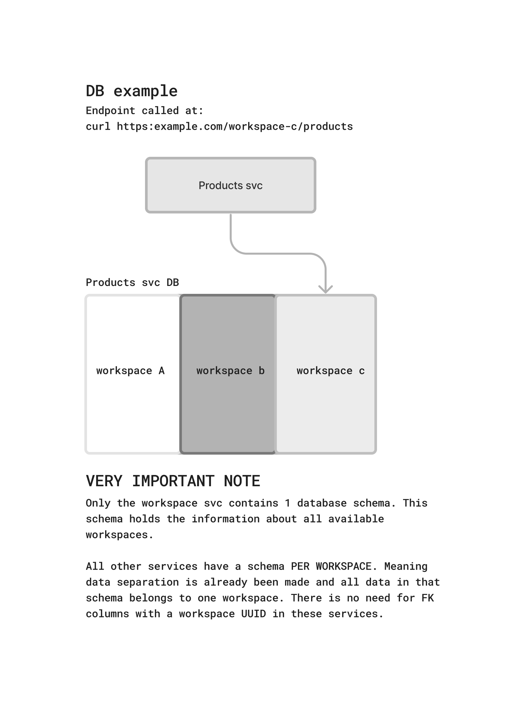

# Laravel Microservices Project

This project is a fully functional demo for building a Microservices architecture SaaS E-commerce platform. The following tech stack is used in this project:

- **Frontend**: Next.js
- **Backend**: Laravel 11
- **Database**: MySQL & DynamoDB
- **Queue**: SQS
- **Cache**: Redis
- **Search**: ElasticSearch
- **CI/CD**: GitHub Actions
- **Containerization**: Docker
- **Orchestration**: Kubernetes
- **Monitoring**: Prometheus & Grafana
- **CDN**: CloudFront
- **DNS**: Route53
- **IaC**: Terraform
- **Secrets Management**: AWS Secrets Manager
- **Logging**: CloudWatch

## Project Structure

The high-level project structure is as follows:



### Note

The image above depicts the high-level architecture of the project. The actual project structure may vary. For example, resources like CDN, DNS, etc., are not shown in the image.

## Database Structure

This application introduces the concept of workspaces. Workspaces represent the tenants of the system that utilize the app for E-commerce needs. Workspaces act as the programmatic barrier between data of different parties. Each workspace will have its own schema in the database of a microservice.

### User Sign-Up Process

1. User signs up for the application by providing Username, Email, Password, and Business name.
2. A workspace record is created in the Workspace service.
3. The Workspace service dispatches events to generate a database schema on each microservice for the workspace.
4. After schema creation, a new user record is created in the Authentication DB schema for the workspace.

In this project, we use the `/workspace_name` to identify which tenant we are working with. Normally, this would be done using subdomains.

### Example

- User registers with the business name: WOUTERBV.
- After the onboarding process, a general endpoint is made available for this business, e.g., [https://example.com/WOUTERBV](https://example.com/WOUTERBV). This endpoint resolves the database schemas.

### Database Structure Example



## Getting Started

To get started with the project, follow the steps below:

### Prerequisites

Ensure you have the following installed on your machine:
- Docker
- Docker Compose
- Node.js
- PHP >= 8.2
- Composer

### Installation

1. Clone the repository:
    ```bash
    git clone https://github.com/WouterLagerwerf/laravel-microservice-project.git
    ```

2. Change directory to the project root:
    ```bash
    cd laravel-microservice-project
    ```

3. Optional: Start a MySQL container using Docker Compose if MySQL is not running locally:
    ```bash
    docker-compose up -d
    ```
    This will launch a MySQL container and a webserver with phpMyAdmin on port 8080.

4. Set up the environment:
    - Make sure you have a `.env` file in the root of each service folder. Copy the `.env.example` file and rename it to `.env`.
    - Ensure the following environment variables are set in your `.env` file:
      ```env
      QUEUE_CONNECTION=sns
      ```

5. Install the custom SNS queue driver package:
    ```bash
    composer require wouterlagerwerf/laravel-sns-queue-driver
    ```
    [Source code](https://github.com/WouterLagerwerf/laravel-sns-queue-driver)

6. Set up the database:
    - Navigate to the workspace service directory:
      ```bash
      cd workspace-svc
      ```
    - Run the database migration command:
      ```bash
      php artisan db:check-and-create
      ```

7. Start the queue workers from the root of each service:
    ```bash
    php artisan queue:work
    ```

### API Authentication

The API for workspace management uses Laravel Passport for Machine-to-Machine authentication. To authenticate the API, create a client in Laravel Passport:
```bash
php artisan passport:client --client
```
This will create a client and return the client ID and client secret. Use these credentials to authenticate the API.

### Using Other Microservices

After running the migrations for the workspace service, use the POST `/api/workspaces` endpoint to create a workspace. This action dispatches events to create the database schemas for the workspace in other applications and creates a user in the authentication service. After this, use the password grant type to authenticate the user and start using the other services.
